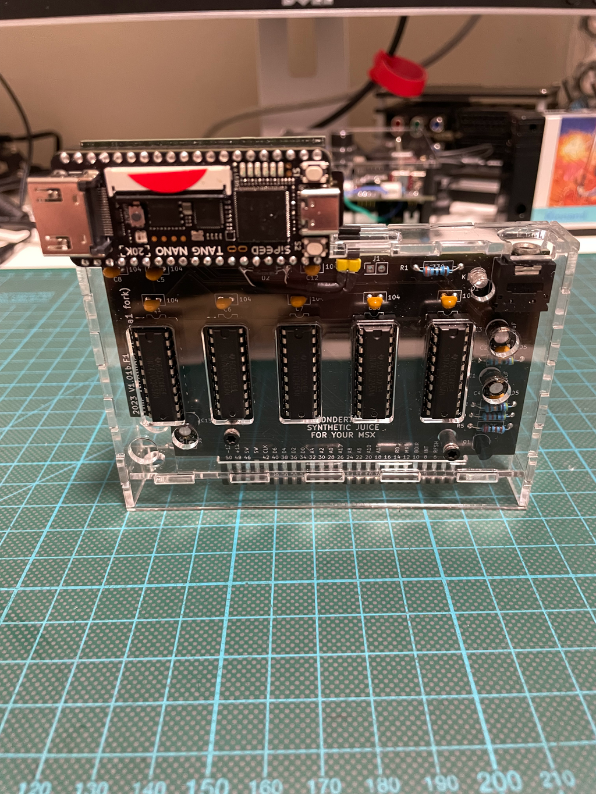
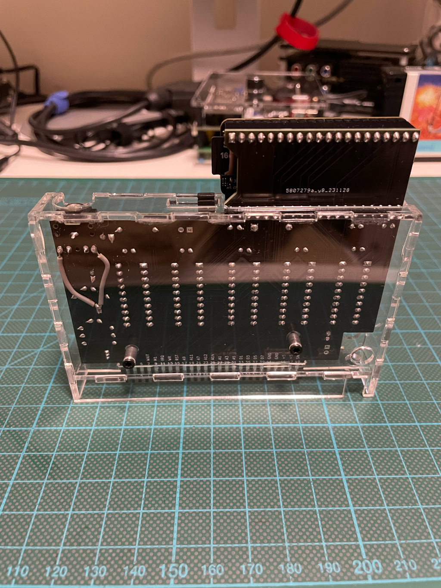
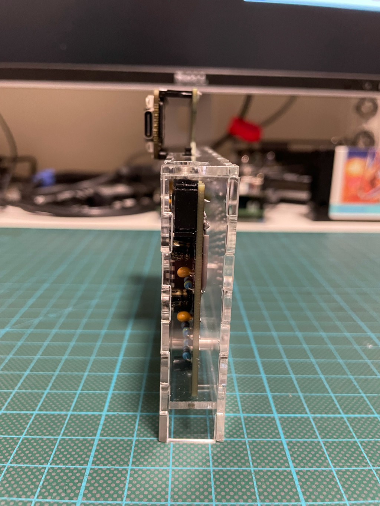
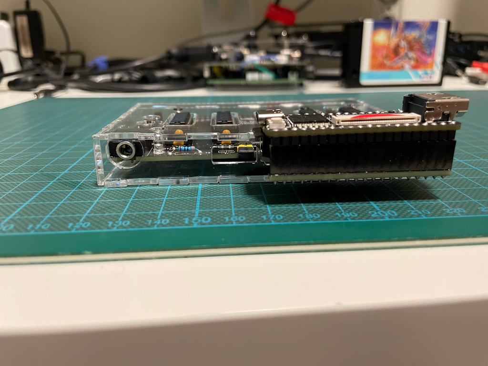
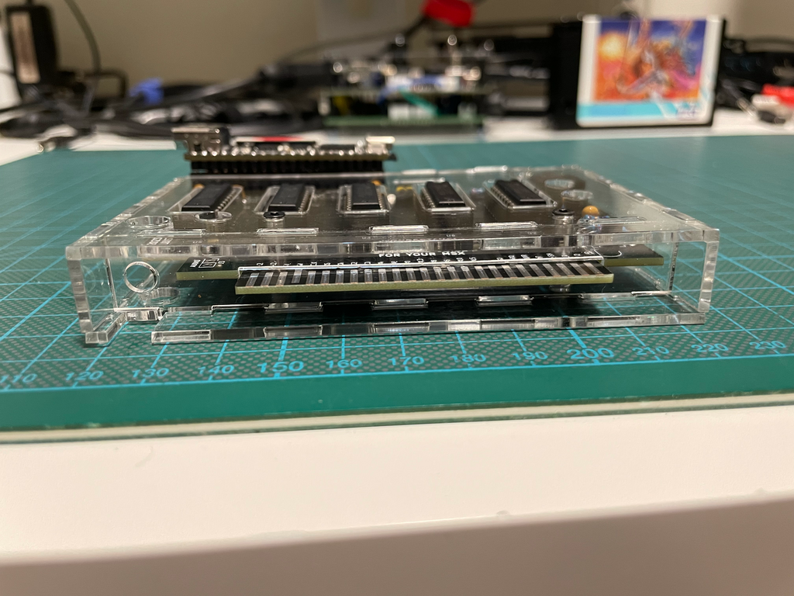

# Acrylic Enclosure for the WonderTANG Cartridge for MSX Computers

## Introduction

The [WonderTANG](https://github.com/lfantoniosi/WonderTANG) by Luis Felipe da Costa Antoniosi is a multifunction cartridge (based on the [Sipeed Tang Nano 20k](https://wiki.sipeed.com/hardware/en/tang/tang-nano-20k/nano-20k.html)) for [MSX computers](https://en.wikipedia.org/wiki/MSX).

This acrylic enclosure is designed specifically for the out of tree [V1.01c.F1-fork](https://github.com/herraa1/WonderTANG/tree/topic/release-V1.01c.F1-fork) of the PCB, which uses a flatter audio connector.

The enclosure is based on the nice [acrylic enclosures by Capsule5000](https://github.com/capsule5000/CARTRIDGE_METHACRYLATE_MSX-EEPROM-Cartridge-64k).

## [Enclosure](enclosure/)

>[!WARNING]
> Photos show the previous enclosure for V1.01b.F1-fork
>

|||
|-|-|
|front|back|

|||
|-|-|
|left|right|

|||
|-|-|
|top|bottom|

## References

Luis Felipe da Costa WonderTANG
* https://github.com/lfantoniosi/WonderTANG

Albert Herranz fork of WonderTANG
* https://github.com/herraa1/WonderTANG/branches/all

Capsule5000 acrylic enclosures
* https://github.com/capsule5000?tab=repositories

